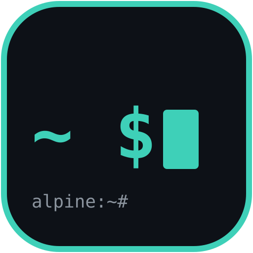

<p align="center">
  
</p>
<h1 align="center">AlpDroid</h1>
<p align="center">Real Alpine Linux on your phone. No root, no VM.</p>
<p align="center">
  
  
  
  
  <a href="https://github.com/anamorsyai/alpdroid/releases"></a>
</p>

AlpDroid runs an Alpine Linux userland directly on the device via `proot`, with its own
from-scratch VT100 terminal emulator and PTY bridge, shared storage at `/sdcard`, and the
device's live network inside the guest.

## Features

- **Multi-tab terminal** — independent shells; tabs survive backgrounding via keep-alive service + session persistence.
- **Own VT100 emulator** — scrollback, 256-color + truecolor, bracketed paste, auto-wrap, mouse reporting for TUIs, reflow-on-resize, pinch zoom.
- **Alpine via proot, no root** — minirootfs on first launch; `proot` fetched at build time.
- **File browser** — Android + Alpine sides, copy/move/zip/share; `/sdcard` bind-mounted.
- **One-tap SSH server** — Settings → Network & SSH starts OpenSSH on port 8022 with a generated password, so a laptop on the same Wi-Fi can log in.
- **One-tap opencode web** — Settings button opens a tab serving the web UI on your LAN.
- **Plugins with approval** — custom Settings screens (`plugin.json` + scripts), schedules, background jobs.
- **Agent API (`alpctl`)** — token-guarded app control for CLI coding agents in a tab.
- **GitHub one-tap sign-in** — device flow, Keystore-encrypted token, automatic git auth.
- **In-app updater** — filling-logo progress, permission-detour resume.
- **Backup / restore** — whole rootfs to one symlink-safe `.tar.gz`, weekly auto option.
- **Devices panel** — SD/USB at `/mnt/...`, USB devices, adapters, Wi-Fi scan.
- **SSH profiles** — one-tap reconnect. **Widget** — new session from home screen.
- **Themes** — palettes, Fira Code ligatures, adjustable type.

## Quick start

1. Download the APK from [Releases](https://github.com/anamorsyai/alpdroid/releases) and install.
2. First launch downloads Alpine (internet once).
3. Grant **All files access** for `/sdcard` sharing.
4. Settings → Quick Install for Node.js, Python, git, agents.

Tabs are temporary — programs stop when the app closes/updates; files persist.

## User guide

Full usage: **[docs/USER_GUIDE.md](docs/USER_GUIDE.md)** (install, tabs, keys, themes, packages,
files, backup, network/SSH/opencode web, devices, GitHub, agent access, plugins, jobs,
updates, keep-alive, widget, troubleshooting). A shorter task guide ships in-app under
Settings → Guide.

## Building from source

Requirements: Java 17, Android SDK 34, NDK `26.3.11579264`, CMake `3.22.1`.

```sh
./gradlew :app:assembleDebug
```

`proot` is fetched at build time (`scripts/fetch_proot.py`) — needs internet to
`packages.termux.dev` and Google's Maven repo. Release signing uses `ALPDROID_*` env
vars; see `.github/workflows/` for the CI release flow. Debug builds use
`app/debug.keystore`.

## Architecture

`TerminalView` (Canvas renderer + `TerminalEmulator` buffer) talks to a native
`pty_bridge` PTY helper over stdin/stdout, resizes on a separate named-pipe channel.
Sessions spawn the guest shell under `proot`; storage is bind-mounted, network shared,
guest DNS refreshed from the host.

## Security model

Guest is trusted (same as Termux): terminal code runs as your UID — run software you
trust. Secrets live encrypted in the Android Keystore. Agent/plugin powers are
off-by-default or approval-gated. Details: [SECURITY.md](SECURITY.md).

## Privacy

No analytics, no tracking, no ads. Network = downloads you trigger + DNS. Backups stay
on your storage. Details: [PRIVACY.md](PRIVACY.md).

## Contributing

See [CONTRIBUTING.md](CONTRIBUTING.md). Roadmap: [ROADMAP.md](ROADMAP.md). Changes: [CHANGELOG.md](CHANGELOG.md).

## License

MIT — see [LICENSE](LICENSE). `proot` (GPL-2.0) and its runtime libs (LGPL-3.0) run as
subprocesses, never linked into app code.
