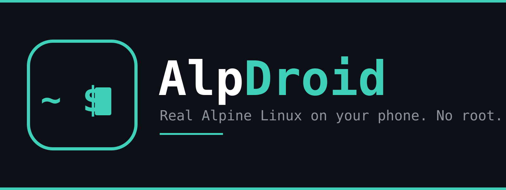
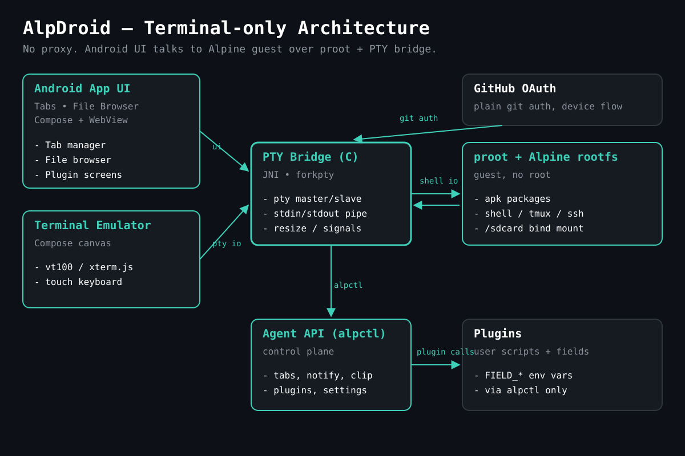

<p align="center">
  
</p>

<p align="center">
  <a href="https://github.com/anamorsyai/alpdroid/releases/latest"></a>
  <a href="https://github.com/anamorsyai/alpdroid/releases"></a>
  <a href="https://github.com/anamorsyai/alpdroid/actions/workflows/ci.yml"></a>
  <a href="LICENSE"></a>
  
  
</p>

<p align="center">
  <b>English</b> · <a href="README.ar.md">العربية</a>
</p>

<p align="center">
  <a href="https://github.com/anamorsyai/alpdroid/releases/latest"><b>Download</b></a> ·
  <a href="docs/USER_GUIDE.md">User guide</a> ·
  <a href="CHANGELOG.md">Changelog</a> ·
  <a href="https://github.com/anamorsyai/alpdroid/issues">Report a bug</a>
</p>

---

**AlpDroid** puts a real [Alpine Linux](https://alpinelinux.org) shell on your Android phone — no root, no
virtual machine, no cloud. Install packages with `apk`, run Node.js, Python or git, start an SSH or web
server, and use command-line coding agents (opencode, Claude Code and others) straight from a phone-friendly
terminal built from scratch for touch.

## Highlights

| | |
|---|---|
| **Real Linux, no root — and tiny** | Alpine runs in userspace through `proot`. A ~2.4 MB app plus a ~3-4 MB base-system download; under 15 MB installed. |
| **A terminal made for phones** | Multi-tab, own VT100/xterm emulator, truecolor, mouse support for TUIs, pinch-zoom, ligatures, an extra-keys row (ESC, TAB, CTRL, ALT, arrows, and your own shortcuts). |
| **One-tap servers** | Start an **SSH server** to log in from your laptop, or the **opencode web** UI for your LAN — each with a generated password. |
| **Built for coding agents** | One-tap installs for opencode, Claude Code and alphacode, keys to launch them, and `alpctl` — a token-guarded API so agents can use the app. |
| **Stays alive in the background** | A foreground service, optional wake lock and Wi-Fi lock keep long builds and servers running with the screen off. |
| **Your files, both sides** | Built-in file browser for Android and Alpine storage; `/sdcard` and USB/SD drives are visible inside Linux. |
| **Safe by design** | No analytics, no ads. Tokens live in the Android Keystore. Plugins and agent powers need your approval. |

## Install

1. Download the latest **`AlpDroid-vX.Y.Z.apk`** (about 2.4 MB) from the [Releases](https://github.com/anamorsyai/alpdroid/releases/latest) page.
2. Open it and allow installs from your browser or file manager when Android asks.
3. Launch AlpDroid. The first start downloads the tiny Alpine base system once (about 3-4 MB) — see [Size](#size).
4. Allow **All files access** if you want `/sdcard` inside Linux.

Updates install straight over the old version — releases are signed with the same key, and the app can
check for and download new versions itself.

**Requirements:** Android 7.0 (API 24) or newer · arm64, armv7, x86_64 or x86.

### Size

AlpDroid uses Alpine's *minirootfs*, the smallest official Alpine image, so the base install is tiny:

| | Size |
|---|---|
| APK download | ~2.4 MB |
| First-run download (Alpine base system) | ~3-4 MB |
| On disk after setup (app + base system) | under 15 MB |

Anything you install afterwards (Node.js, Python, git, agents...) adds its own size on top. Packages come from Alpine's repositories, which are far smaller than other distributions'.

## Quick start

```sh
apk add --no-cache git python3 nodejs npm   # or use Settings → Quick install
git clone https://github.com/<you>/<repo>
```

- **Quick install** (Settings): Node.js, Python, git, opencode, Claude Code, alphacode, editors and more.
- **SSH from a laptop:** Settings → Network & SSH → *Start SSH server*. The app shows
  `ssh -p 8022 root@<phone-ip>` and a password; *Add SSH public key* lets you log in with a key instead.
- **Browser UI:** *Start opencode web server* serves it on your Wi-Fi at port 4096.
- **Keep it running:** allow *Unrestricted* battery use when the app asks, so servers survive a locked screen.

See the full **[User guide](docs/USER_GUIDE.md)** — also available inside the app under *Settings → Guide*.

## Everything it does

<details>
<summary><b>Terminal</b></summary>

- Independent tabs with rename, close and save-screen; tabs survive backgrounding.
- Scrollback, 256-color and truecolor, bracketed paste, reflow on resize, mouse reporting, search.
- Themes, Fira Code / JetBrains Mono, adjustable size, optional ligatures and bell sound.
- Custom one-tap shortcut buttons, plus built-in `alphacode` and `claude` launchers.
</details>

<details>
<summary><b>Servers and network</b></summary>

- One-tap SSH server (OpenSSH on port 8022, password or public key).
- One-tap opencode web server on your LAN.
- SSH profiles for quick reconnects, live DNS refresh after Wi-Fi/mobile switches, fallback apk mirrors.
- Devices panel: SD/USB drives, USB devices, network adapters and traffic, Wi-Fi scan.
</details>

<details>
<summary><b>Files and backup</b></summary>

- File browser for Android and Alpine sides: copy, move, rename, compress, extract, share, *Open terminal here*.
- Backup and restore the whole Alpine system to a single `.tar.gz`, with optional weekly automatic backups.
</details>

<details>
<summary><b>Agents, GitHub and plugins</b></summary>

- `alpctl`: a local, token-guarded API for CLI agents (tabs, clipboard, notifications, settings).
- GitHub one-tap sign-in (device flow). Opt in to let `git` and agents use the token.
- Plugins: your own Settings screens defined by `plugin.json` plus scripts, with scheduled and background jobs.
  Every plugin must be reviewed and approved by you before it runs.
</details>

<details>
<summary><b>App</b></summary>

- In-app updater, home-screen widget, progress notifications for long file operations.
- A foreground service, wake lock and Wi-Fi lock for background work, with plain-language guidance when Android kills the app.
</details>

## FAQ

**Is this root or a virtual machine?** Neither. Alpine runs as ordinary processes under `proot`, which fakes
root inside the guest only. It cannot touch the rest of Android.

**Can I run graphical apps?** No — AlpDroid is a terminal environment (CLI tools, servers, build tools).

**Why does my background process stop?** Android can kill background apps. Keep the keep-alive notification
on, allow *Unrestricted* battery use, and keep the wake lock on for long jobs. Open sessions cannot survive a
system kill; files do. On Android 12+ some devices additionally limit child processes — see the
[troubleshooting section](docs/USER_GUIDE.md#18-troubleshooting).

**Is it safe?** The guest is trusted like Termux: programs you run have the same access as the app. Secrets
are stored encrypted in the Android Keystore, and agent/plugin powers are opt-in. Details in
[SECURITY.md](SECURITY.md).

**Does it collect data?** No analytics, tracking or ads. See [PRIVACY.md](PRIVACY.md).

## Building from source

Requirements: JDK 17, Android SDK 34, NDK `26.3.11579264`, CMake `3.22.1`, Python 3.

```sh
./gradlew :app:assembleDebug     # fetches proot from packages.termux.dev at build time
./gradlew :app:installDebug
```

Release signing uses `ALPDROID_*` environment variables; the release flow lives in
[`.github/workflows/alpdroid-release.yml`](.github/workflows/alpdroid-release.yml). More in
[CONTRIBUTING.md](CONTRIBUTING.md).

## How it works

<p align="center">
  
</p>

`TerminalView` renders the hand-written `TerminalEmulator` buffer. It talks to a small native `pty_bridge`
helper that gives each shell a real PTY (resizes travel over a separate named pipe). Each session runs the
Alpine shell under `proot`, with storage bind-mounted and the device's network shared.

## Project

- [User guide](docs/USER_GUIDE.md) · [Changelog](CHANGELOG.md) · [Roadmap](ROADMAP.md)
- [Contributing](CONTRIBUTING.md) · [Code of conduct](CODE_OF_CONDUCT.md) · [Security policy](SECURITY.md) · [Privacy](PRIVACY.md)

## Acknowledgements

[Alpine Linux](https://alpinelinux.org) · [proot](https://proot-me.github.io) (GPL-2.0, run as a separate
process, never linked into the app) via the [Termux](https://termux.dev) package repository ·
[Fira Code](https://github.com/tonsky/FiraCode) and [JetBrains Mono](https://www.jetbrains.com/lp/mono/) (SIL OFL).

## License

[MIT](LICENSE).
